# Deep learning e visão computacional na identificação e análise de talhões agrícolas: Uma Abordagem Prospectiva para a Região Sul do Brasil

André Junior, Arthur Reis, Jonas Viana Sales, Mateus Rafael, Melyssa Rojas, Leandro Custódio e Yasmin Vitória Rocha

**Resumo**

Este estudo aborda o desafio da segmentação binária em imagens sintéticas baseadas nos dados do satélite Sentinel-2, visando aprimorar a precisão na identificação de talhões em áreas agrícolas. Foi desenvolvido um sistema com base na arquitetura U-Net, utilizando a rede VGG16 como backbone. O sistema emprega técnicas de processamento de imagens para aprimorar a precisão na segmentação binária, com foco especial na identificação dos limites dos talhões. A metodologia incluiu o uso de conjuntos de dados sintéticos e de satélite para treinamento e validação do modelo. As métricas de avaliação, incluindo Recall e Specificity, demonstraram que o modelo proposto alcança resultados satisfatórios na segmentação binária de áreas agrícolas em imagens de satélite.

**Palavras-chave**: Segmentação binária, Talhões agrícolas, U-Net, VGG16, Processamento de imagens, Recall, Specificity.

**Abstract**

This study addresses the challenge of binary segmentation in synthetic images based on Sentinel-2 satellite data, aiming to enhance the accuracy in identifying agricultural plots. A system was developed based on the U-Net architecture, using the VGG16 network as a backbone. The system employs image processing techniques to improve binary segmentation accuracy, with a special focus on identifying plot boundaries. The methodology included the use of synthetic datasets for model training and validation. Evaluation metrics, including Recall and Specificity, demonstrated that the proposed model achieves satisfactory results in binary segmentation of agricultural areas in satellite images.

**Keywords**: Binary segmentation, Agricultural plots, U-Net, VGG16, Image processing, Recall, Specificity.

## 1. Introdução
A agricultura de precisão é fundamental na otimização da produção agrícola e na promoção do uso sustentável de recursos. Com o avanço de tecnologias como Machine Learning, Inteligência Artificial e Deep Learning, a visão computacional tem emergido como uma ferramenta poderosa para análises automatizadas de imagens de satélite, possibilitando a extração de informações detalhadas sobre áreas de cultivo com precisão. Este processo é crucial para a identificação e delimitação de talhões agrícolas, o que é essencial para diversas aplicações na agricultura, incluindo estimativas de produtividade das safras, crédito agrícola, identificação de pragas e doenças, e monitoramento do desenvolvimento das culturas [[1]](#referencia-1)[[2]](#referencia-2)[[3]](#referencia-3)[[4]](#referencia-4)[[5]](#referencia-5).

 No entanto, a segmentação de talhões agrícolas em imagens de satélite enfrenta desafios significativos envolvendo a diversidade de culturas, variações nas condições de iluminação e solo, e a complexidade das formas e tamanhos dos talhões, especialmente em regiões com terrenos irregulares. Estas condições afetam a precisão dos algoritmos de segmentação e, consequentemente, a qualidade dos resultados obtidos [[6]](#referencia-6). Na região Sul do Brasil, esses desafios se acentuam devido às características geográficas específicas e às parcelas de terra fragmentadas e irregulares, o que dificulta a identificação precisa dos talhões ao usar métodos tradicionais de segmentação. 

Diante desses desafios, o objetivo deste artigo é desenvolver e validar um modelo de visão computacional baseado em Deep Learning, especificamente adaptado para aprimorar a segmentação de talhões agrícolas. Pretende-se superar as limitações das técnicas convencionais, combinando diferentes abordagens para lidar com a complexidade e a variabilidade das imagens de satélite, proporcionando uma ferramenta mais precisa para a identificação de talhões. Este trabalho também abordará o processo de desenvolvimento do modelo adotado, incluindo as escolhas de arquitetura e os resultados obtidos, demonstrando sua eficácia na identificação de áreas de cultivo, mesmo em condições de terreno complexas e irregulares, contribuindo assim para o avanço da pesquisa em visão computacional aplicada à agricultura de precisão.

## 2. Trabalhos relacionados

O projeto que está sendo desenvolvido pelo grupo tem um cunho bem específico, no entanto, existem trabalhos relacionados que podem ser citados para embasar a pesquisa.

| Descrição do Trabalho | Ano de Publicação | Referência |
| --- | --- | --- |
| Utilização de _deep learning_ e IA para automatizar tarefas agrícolas | 2021 | [[7]](#referencia-7) |
| Agricultura de precisão com imagens de satélite e visão computacional | 2021 | [[9]](#referencia-9) |
| Segurança alimentar contínua com visão computacional | 2021 | [[10]](#referencia-10) |
| Segmentação de imagens para acompanhamento do crescimento de frutas agrícolas | 2021 | [[11]](#referencia-11) |
| Detecção de ervas daninhas em campos de agricultura com CNNs | 2021 | [[12]](#referencia-12) |
| Utilização de _deep learning_ para segmentação de imagens com IoU de 98,46% no pós-processamento | 2021 | [[13]](#referencia-13) |
| Contagem de plantas com imagens de satélite | 2021 | [[2]](#referencia-2) |
| Identificação de campos agrícolas com imagens de satélite | 2021 | [[14]](#referencia-14) |
| Classificação de áreas cultivadas com séries temporais de imagens de satélites | 2021 | [[15]](#referencia-15) |
| Identificação do uso de máscara com visão computacional | 2021 | [[16]](#referencia-16) |
| Principais pontos da visão computacional em Ciência da Computação | 2021 | [[17]](#referencia-17) |

## 3. Materiais e métodos

O presente projeto emprega uma abordagem interdisciplinar, integrando técnicas de visão computacional e _deep learning_ para o desenvolvimento de um sistema robusto capaz de identificar talhões agrícolas por meio da análise de imagens de satélite. Para isso, foi adotada a metodologia ágil _Scrum_, que possibilita a entrega incremental de valor e a rápida adaptação às necessidades do projeto, o qual conduz o trabalho em _sprints_ que possuem duração de duas semanas e que se estende num total de dez semanas. A pesquisa concentra-se em dados coletados durante o período de 2023, abrangendo várias regiões agrícolas da Região Sul do Brasil, com foco no estado do Rio Grande do Sul, com o objetivo de desenvolver um modelo adaptado às especificidades locais.

### 3.1 Materiais

Para o desenvolvimento deste projeto, com enfoque no modelo _U-net_ e auxílio da rede neural pré-treinada _VGG16_ capazes de segmentarem estes talhões produtivos da região Sul via imagens de satélite, utilizamos como materiais as bibliotecas de programação em Python, que desempenharam papéis essenciais no processamento e análise das imagens de satélite, bem como na implementação dos modelo de segmentação mencionado logo no início deste parágrafo. 
Desde já, é preciso reforçar as referências bibliográficas que foram essenciais para a validação das bibliotecas. Dentre elas estão os livros de _Jake Vanderplas_ [[18]](#referencia-18) que oferece informações básicas das bibliotecas primordiais de _Data Science_, _François Chollet_ [[19]](#referencia-19) que aborda a biblioteca _Keras_ e _Tensorflow_. Já o _scikt-learn_ utilizamos o _website_ oficial scikit-learn deles como consulta [scikit-learn Documentation]. Para a parte de segmentação de modelos foi utilizada a documentação oficial do _Github_ da _segmentation_models_ [[20]](#referencia-20). Para bibliotecas mais simples, como _Pillow_, _random_, _time_ e _psutil_ foram utilizadas também suas respectivas documentações oficiais [_Pillow_ [[21]](#referencia-21), _random_ [[22]](#referencia-22), _time_ [[23]](#referencia-23), _psutil_ [[24]](#referencia-24)]. Vale ressaltar que estas últimas bibliotecas que foram utilizadas são antigas e foram criadas e documentadas nos primórdios da linguagem Python (1994). Entretanto, elas são atualizadas conforme as novas versões da linguagem de programação. A mesma coisa acontece nas documentações das bibliotecas _scikit-image_ [[25]](#referencia-25) e _SciPy_ [[26]](#referencia-26), elas são antigas, mas também são atualizadas conforme as novas versões da linguagem de programação e se adequam na resolução de problemas atuais como este enfrentado.

A seguir, há uma breve descrição de cada uma dessas bibliotecas e suas funções desenvolvimento do projeto:

- _**os**_: Biblioteca padrão do _Python_ que permite interação com o sistema operacional. Foi utilizada para navegar pelos diretórios e gerenciar arquivos [[18]](#referencia-18).

- _**NumPy**_: Utilizada para a manipulação de arrays e de matrizes multidimensionais, essenciais para o processamento das imagens de satélite [[18]](#referencia-18).

- _**Pandas**_: Foi usada para manipular e analisar grandes conjuntos de dados associados às características dos talhões [[18]](#referencia-18)

- _**Matplotlib**_: Biblioteca de plotagem para Python utilizada para criar gráficos e outras visualizações em _2D_. Foi essencial para visualizar os dados e os resultados dos processos de detecção dos talhões, facilitando a interpretação e a apresentação dos resultados [[18]](#referencia-18).

- _**Pillow (PIL Fork)**_: Biblioteca de processamento de imagens que permite a abertura, manipulação e salvamento de diversos formatos de arquivos de imagem. Foi utilizada para ler e escrever imagens no formato _.tif_, além de facilitar a transformação e manipulação dessas imagens durante o pré-processamento [[21]](#referencia-21).

- _**random**_: Foi usada para operações que requerem randomização, como a divisão dos dados em conjuntos de treino e teste de forma aleatória [[22]](#referencia-22).

- _**Keras**_: _API_ de alto nível que facilita a construção e treinamento de redes neurais. Utilizada em conjunto com _TensorFlow_ para desenvolver e treinar modelos de _deep learning_, como o modelo _U-Net_ [[19]](#referencia-19).

- _**keras.layers**_: Módulo da biblioteca _Keras_ que fornece componentes básicos para a construção de redes neurais, como camadas densas, convolucionais, de ativação, entre outras [[19]](#referencia-19).

- _**keras.models.Sequential**_: Classe da biblioteca _Keras_ que permite criar modelos sequenciais, onde as camadas são empilhadas uma após a outra [[19]](#referencia-19).

- _**keras.optimizers.Adam**_: Otimizador Adam da biblioteca _Keras_, utilizado para otimizar o processo de treinamento das redes neurais [[19]](#referencia-19).

- _**keras.utils (Sequence)**_: Classe da biblioteca _Keras_ usada para criar geradores de lotes para o treinamento do modelos [[19]](#referencia-19).

- _**TensorFlow**_: Foi usada para construir e treinar modelos de _deep learning_ [[19]](#referencia-19).

- _**tensorflow.keras**_: Módulo da biblioteca _TensorFlow_ que contém a _API Keras_, permitindo a construção e treinamento de modelos de _deep learning_ [[19]](#referencia-19).

- _**tensorflow.keras.backend (K)**_: Módulo da biblioteca TensorFlow que fornece funções de baixo nível para a construção e manipulação de redes neurais [[19]](#referencia-19).

- _**scikit-learn (sklearn)**_: Utilizada na divisão dos dados em conjuntos de treino e teste com train_test_split, e para calcular métricas de avaliação como accuracy_score, recall_score e precision_score [_scikit-learn Documentation_].

- _**time**_: Utilizada para manipulação de tempo e medição de desempenho dos processos de treinamento dos modelos [[23]](#referencia-23).

- _**psutil**_: Biblioteca utilizada para monitoramento de recursos do sistema, como o uso de memória e _CPU_ durante a execução dos _scripts_ [[24]](#referencia-24).

- _**segmentation_models**_ : Biblioteca que fornece modelos pré-treinados para segmentação de imagens. Utilizamos especificamente o modelo _U-Net_ com _backbone VGG16_, essencial para a segmentação dos talhões nas imagens de satélite [[20]](#referencia-20).

- _**segmentation_models.Unet**_ : Implementação do modelo _U-Net_ fornecida pela biblioteca segmentation_models. Utilizada para construir a arquitetura do modelo de segmentação de imagens [[20]](#referencia-20).
  
- _**skimage.measure (meas)**_: Módulo da biblioteca _scikit-image_ utilizado para processamento e análise de imagens, como medir propriedades de regiões etiquetadas em uma imagem [[25]](#referencia-25).

- _**scipy.ndimage.zoom**_: Função da biblioteca _SciPy_ usada para operações de zoom em imagens, permitindo redimensionar imagens de maneira precisa [[26]](#referencia-26).

- _**cv2**_ : Biblioteca OpenCV para aplicar erosão e dilatação no pós-processamento [[37]](#referencia-37).

Estas bibliotecas e ferramentas foram cuidadosamente selecionadas e combinadas para garantir um fluxo de trabalho eficiente e eficaz no processamento das imagens de satélite e na implementação dos modelos de segmentação para a identificação dos talhões.
  
Para o desenvolvimento em termos de código, a plataforma _Google Colab_ [[27]](#referencia-27) foi escolhida por executar facilmente os _scripts_. Por ser vinculada à nuvem, oferece maior capacidade de integração multidisciplinar, compartilhamento e acesso a outras ferramentas e serviços, o que faz jus ao nome, pois oferece um ambiente colaborativo. Para a aquisição de dados, optou-se pela ferramenta EO Browser para extrair as bandas espectrais necessárias para o estudo a partir de imagens de satélite, além da aplicação de imagens sintéticas criadas por professores do Inteli. O _EO Browser_ permite acessar, visualizar e analisar dados de múltiplos satélites, facilitando a seleção e o _download_ das imagens _.tif_ que são fundamentais para a identificação dos talhões. Já as imagens sintéticas, são criadas de forma artificial com o intuito de imitar as leituras reais de um satélite, oferecendo imagens no formato PNG, ao invés das bandas espectrais obtidas pelo _EO Browser_.

### 3.2 Métodos

Nesta seção, serão apresentados os experimentos conduzidos na região sul do Brasil, aproveitando suas características territoriais distintas. Foram implementados dois modelos distintos: um utilizando imagens sintéticas e outro utilizando imagens do satélite Sentinel-2. O processo de pré-processamento dos dados será detalhado, descrevendo como os dados foram preparados, incluindo técnicas de data augmentation para enriquecimento do dataset. Além disso, serão fornecidas descrições dos modelos empregados e suas respectivas configurações.

### 3.2.1 Fonte de dados

As imagens de satélite do Sentinel-2, no formato .tif, foram utilizadas com as bandas b5, b8 e b12, escolhidas por promoverem maior impacto na tarefa de segmentação binária em áreas de cultivo. Para obter as targets do modelo supervisionado, foi realizado um processo manual no software QGIS para a criação das máscaras binárias, que servirão como ground truth.

As imagens Sintetícas foram geradas de forma artificial por professores do Inteli e disponibilizadas aos alunos com o intito de realizar testes mais aprofundados, possuindo uma maior variedade de dados disponíveis.

Nas seções seguintes, a partir do dataset atual, serão apresentadas transformações e enriquecimentos dos dados visando a eficiência do modelo.

### 3.2.2 Pré-processamento 

Para preparar os dados para os modelos, esta seção aborda o pré-processamento realizado. As principais tarefas foram: redimensionamento de canais e normalização dos dados.

As principais etapas são detalhadas a seguir:

#### 3.2.2.1 Carregamento usando divisão de imagens por lote

Foi criada uma função que percorre todos os diretórios e arquivos localizados no caminho determinado. Para cada diretório encontrado, a função inicializa uma lista destinada a armazenar as imagens carregadas (chamada de de image_data_batch), juntamente com uma variável que contabiliza o número de imagens presentes no lote atual (_count_).

Subsequentemente, a função verifica se cada arquivo possui a extensão "_.tif_" e se o nome do arquivo está contido na lista de arquivos válidos, a qual inclui "_b8.tif_", "_b12.tif_" e "_b5.tif_" (bandas espectrais das imagens utilizadas para teste e treinamento). Somente esses arquivos específicos são considerados válidos para carregamento. Para cada arquivo válido, a função utiliza _Image.open_ para carregar a imagem e adiciona a mesma à lista incrementando simultaneamente o contador.

Quando o contador atinge o valor predefinido do tamanho do lote (neste caso, 32), o lote atual (image_data_batch) é adicionado à lista é utilizada para armazenar todos os lotes de imagens carregadas pela função (self.all_images). Posteriormente, a lista image_data_batch é reinicializada e o contador _count_ é resetado para zero, preparando-se para formar um novo lote. Ao concluir o _loop_ de arquivos, se existir um lote que não atingiu o tamanho especificado por batch_size (ou seja, image_data_batch não está vazio), este lote é adicionado à lista self.all_images.

Este procedimento garante que as imagens são processadas em blocos manejáveis, o que facilita o processamento subsequente. A metodologia adotada assegura uma organização eficiente dos dados e otimiza o uso de recursos computacionais durante o carregamento e processamento das imagens [[35]](#referencia-35).

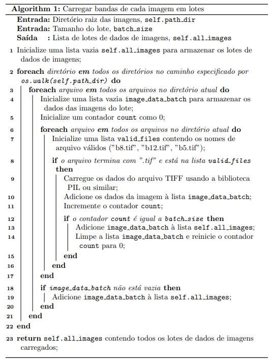

#### 3.2.2.2 Carregamento de imagens sintéticas

Para o carregamento das imagens sintéticas, foi criada uma função cuja realiza a leitura das imagens utilizadas, então converte os dados para RGB e cria um array com 300 imagens. Esta função é utilizada tanto para o carregamento das imagens de entrada de das labels.

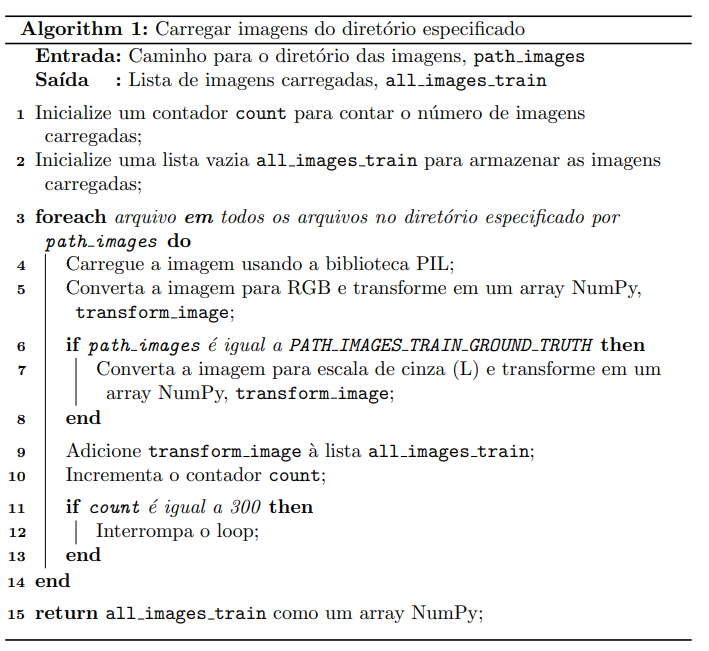

#### 3.2.2.3 Redimensionamento de Canais

Para garantir que todos os canais pertencentes a uma imagem possuísem o mesmo tamanho foi utilizado como padrão o tamanho 1200x1200 para redimensionamento com a biblioteca Pillow [[21]](#referencia-21), valor semelhante ao utilizado pela empresa AG, a lógica utilizada para este fim está logo abaixo:

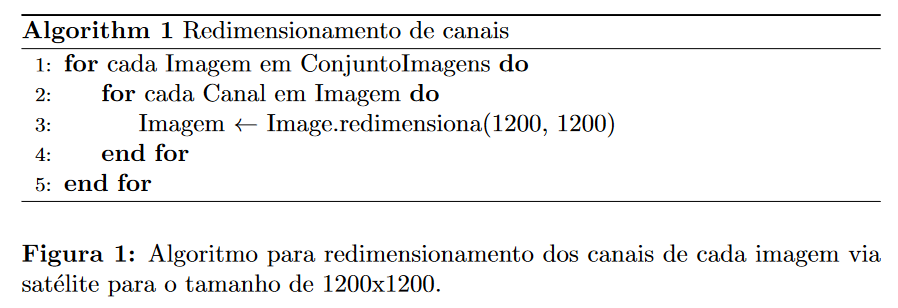

#### 3.2.2.4 Normalização dos Dados

Para garantir a eficácia dos modelos permitindo maior agilidade na convergência foi necessário normalizar os dados para que ficassem na escala de [0,1], para este fim foi necessário utlizar como parâmetro o valor máximo de intensidade do pixel em cada banda, a lógica utilizada para este fim está logo abaixo:

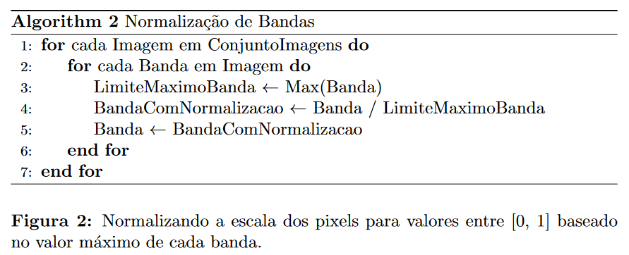

#### 3.2.2.5 Corte das Imagens e Labels

Esta técnica cria sub-imagens a partir de uma imagem macro, dividindo-a em pequenas regiões [[29]](#referencia-29). Por exemplo, uma imagem macro de dimensões (1200, 1200) é dividida em sub-imagens de (192, 192), resultando em 36 sub-imagens. Um exemplo em pseudocódigo desta lógica por trás dessa técnica é a seguinte:

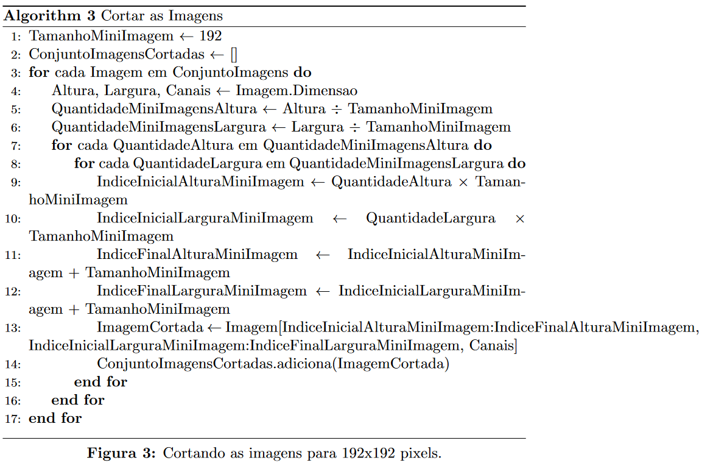

Vale ressaltar que, para o corte de labels, o parâmetro "Canais" na linha 13 da figura acima não é necessário. Além disso, no modelo com o uso das imagens sintéticas, foram realizados apenas os processos Carregamento de imagens sintéticas e Corte das Imagens e Labels, enquanto no modelo sem o uso destes dados, apenas o uso do Carregamento de imagens sintéticas não foi necessário.

### 3.2.3 Data Augmentation

Para enriquecer o conjunto de dados e garantir maior generalização do modelo sem o uso de imagens sintéticas frente às variações em imagens de satélite, foram implementadas técnicas de transformações geométricas e filtros de imagem para o aumento de dados para regularização [[28]](#referencia-28). Esse processo é crucial devido ao tamanho limitado do conjunto de dados, composto por 15 imagens de dimensões (1200, 1200, 3).

#### 3.2.3.1 Balanceamento da Augmentação

Os dados augmentados representam uma pequena fração do dataset original. Todas as funções de augmentação recebem imagens e labels como parâmetros, assim como adicionais especificados pela tabela abaixo. Depois da união entre as dados augmentados e dataset original, chegamos a 762 imagens, onde a augmentação representa aproximadamente 41.1% delas.

|        | parâmetros   | quantidade | fração |
|--------|--------------|------------|--------|
| flip   | 0, 1         | 74         | 33,3%  |
| rotate | 90, 180, 270 | 111        | 50%    |
| gauss  | n = 1        | 37         | 16,7%  |
| total  |              | 222        | 100%   |

#### 3.2.3.2 Espelhar as Imagens e Labels

Essa técnica espelha as imagens e labels horizontalmente e verticalmente [[36]](#referencia-36). Vale ressaltar que o pseudocódigo exemplo abaixo somente espelha horizontalmente as imagens e labels. Para o espelhamento vertical, troca-se o nome da função EspelharHorizontalemnte para EspelharVerticalmente. Está é a implementação lógica:

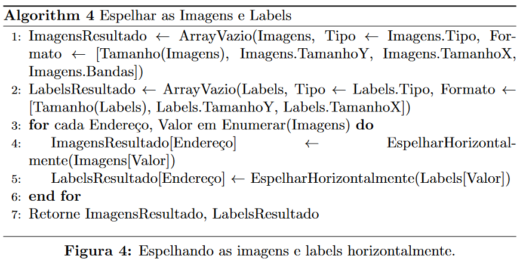

#### 3.2.3.3 Rotacionar as Imagens e Labels

Esta técnica rotaciona as imagens e labels em 90, 180 e 270 graus [[36]](#referencia-36). Está é a implementação lógica:

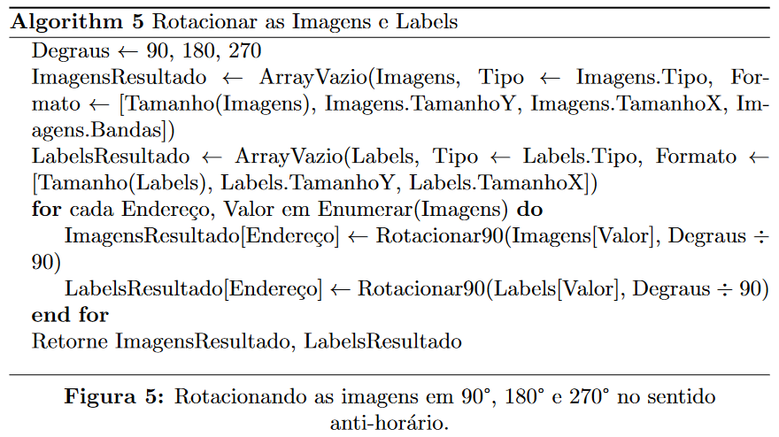

#### 3.2.3.4 Filtro Gaussiano

Esta técnica aplica o filtro gaussiano (blur) somente nas imagens. Esta função é bastante usada em tratamento, pois ajuda a reduzir ruídos nas imagens, e seu impacto nos resultados foi testado, como é possível ver na tabela acima no subtópico 3.2.3.1. Está é a implementação lógica:

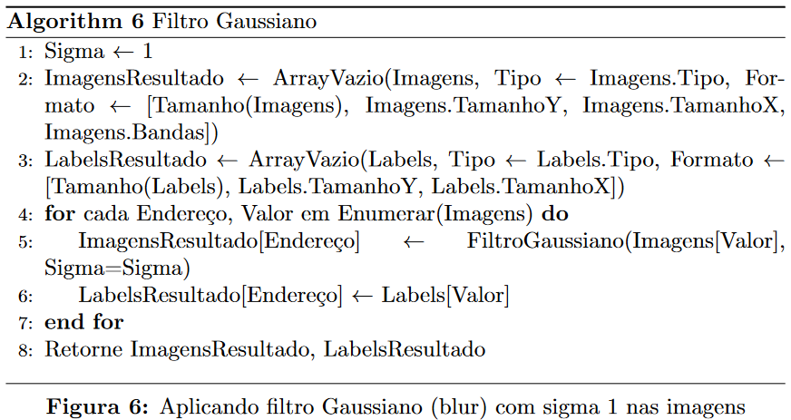

### 3.2.4 Função de Perda e Métricas Escolhidas

Para melhorar a eficiência das predições em modelos de segmentação de imagens, é essencial atualizar os pesos do modelo adequadamente. O modelo processa uma entrada de matriz com três canais e gera uma matriz de saída com um canal, onde cada valor representa a probabilidade de um pixel ser positivo, considerando um limiar de 0.5. A comparação entre essa matriz predita e a matriz target (valores binários) é crucial para o cálculo da perda.

Um problema comum em segmentação de imagens é o desbalanceamento de classes. Frequentemente, a classe positiva (1) é predominante no conjunto de dados, enquanto a classe negativa (0) é minoritária. Esse desbalanceamento pode levar o modelo a subvalorizar a classe negativa, essencial para a precisão nas bordas para uma segmentação ótima sob os talhões. Para mitigar esse problema, foi utilizada a função de perda _Weighted Dice Loss_ [[30]](#referencia-30).

A função _Weighted Dice Loss_ é uma modificação da função Dice Loss, que por sua vez é baseada no coeficiente Dice, cujo é definido como:

$$
\text{Dice Loss} = 1 - \text{Dice Coefficient}
$$

Onde o Dice Coefficient é dado por:

$$
\text{Dice Coefficient} = \frac{2 |A \cap B|}{|A| + |B|}
$$

Aqui, \(A\) representa as previsões binárias e \(B\) representa a máscara binária verdadeira.

Em termos de somatórios para uma implementação prática, pode escrever o Dice Coefficient da seguinte forma:

$$
\text{Dice Coefficient} = \frac{2 . \sum_{i=1}^N p_i g_i}{\sum_{i=1}^N p_i + \sum_{i=1}^N g_i}
$$

Onde:
- \(p_i\) são os valores preditos pelo modelo (predições binárias ou probabilidades)
- \(g_i\) são os valores reais (máscara de verdadeiros positivos)
- \(N\) é o número total de pixels

No caso da _Weighted Dice Loss_, o cálculo é ajustado para considerar diferentes pesos para as classes positiva (1) e negativa (0). A fórmula do coeficiente Dice ponderado é:

$$
\text{Weighted Dice Loss} = 1 - \frac{(1-β^2) . \sum_{i=1}^N w_i p_i g_i + s}{\sum_{i=1}^N w_i p_i + \sum_{i=1}^N g_i + s}
$$

Onde:
- \(β) é o fator de ajuste da perda da dice Loss
- \(w_i\) são os pesos (usados para dar mais enfase a respectiva classe)
- \(s\) é o parâmetro smooth (usado para evitar divisões por zero)

Essa abordagem ajuda o modelo a equilibrar as classes e melhorar a precisão, especialmente nas bordas das regiões segmentadas, reduzindo a discrepância entre classes positiva e negativa.

Os pesos que o modelo usa para dar prioridade à uma classe ou outra são hiperparâmetros, ou seja, eles podem ser ajustados para que o modelo alcance resultados melhores.

Seguidamente, para a avaliação do modelo, foram selecionadas as métricas Recall e Specificity, que se adequam bem ao contexto do problema. A seguir, será apresentado os motivos das escolhas e as fórmulas dessas métricas, juntamente com a relação com a função de perda _Dice Loss_.

O Recall foi escolhido porque foca no número de pixels verdadeiros positivos em relação ao total de pixels positivos (verdadeiros positivos mais falsos negativos) [[31]](#referencia-31). Esta métrica é crucial para avaliar se o modelo consegue identificar corretamente a classe positiva (1), que representa uma área de cultivo.

O recall é dado pela fórmula:

$$ 
\text{Recall} = \frac{TP}{TP + FN} 
$$

Onde:
- \( TP \) (True Positives) é o número de verdadeiros positivos.
- \( FN \) (False Negatives) é o número de falsos negativos.

O Recall permite medir a eficiência do modelo na identificação da classe 1, essencial para garantir que áreas de cultivo sejam corretamente detectadas.

Outrora, a Specificity foi escolhida porque foca no número de pixels verdadeiros negativos em relação ao total de pixels negativos (verdadeiros negativos mais falsos positivos) [[29]](#referencia-29). Esta métrica é importante para avaliar se o modelo consegue identificar corretamente a classe negativa (0), que representa as bordas e outras áreas que não são regiões de cultivo.

A Specificity é dada pela fórmula:

$$ \text{Specificity} = \frac{TN}{TN + FP} $$

Onde:
- \( TN \) (True Negatives) é o número de verdadeiros negativos.
- \( FP \) (False Positives) é o número de falsos positivos.

A Specificity permite medir a eficiência do modelo na identificação da classe 0, garantindo que as áreas não cultivadas sejam corretamente diferenciadas das áreas de cultivo.

Concluindo, para garantir a eficácia do modelo, é ideal que ambas as métricas, Recall e Specificity, apresentem valores altos. Isso indicaria que o modelo valoriza ambas as classes de maneira equilibrada. Valores muito discrepantes entre as duas métricas sugerem que o modelo está favorecendo uma classe em detrimento da outra. Ademais, uma baixa pontuação do _Dice Loss_ indica uma alta precisão na detecção das classes positivas e negativas, refletindo em altos valores de Recall e Specificity.

É importante salientar que esta etapa não foi realizada no modelo com o uso de imagens sinteticas, uma vez que, o numero de dados disponibilizados é grande, fazendo com que o uso destas tecnicas não seja necessária ou até mesmo dificulte na execussão do modelo, ja que o número de imagens gerado seria massivo.

### 3.2.5 Modelo

Esta seção apresentará o modelo desenvolvido utilizando transferência de aprendizagem. O modelo combina a arquitetura U-Net com o VGG16 pré-treinado, adaptando-o ao contexto do problema e à tarefa de segmentação semântica. As subseções detalharão o processo de abordagem para construção e as configurações do modelo.

#### 3.2.5.1 Abordagem para a Construção do Modelo U-Net com VGG16

Na abordagem de construção do modelo com transferência de aprendizagem, é crucial destacar as contribuições de cada arquitetura de Rede Neural Convolucional (CNN) usada na combinação que forma o modelo final, e os conceitos aplicados.

A U-Net, implementada através da biblioteca Segmentation Models, é uma arquitetura projetada especificamente para segmentação semântica, alinhando-se com o objetivo deste artigo. A U-Net é composta por duas partes principais: o Encoder (codificador) e o Decoder (decodificador), formados por camadas convolucionais (operações de convolução com filtros que variam de 32 até 512 após o processo de experimentação de combinação de filtros usando a abordagem Random Search [[29]](#referencia-29)), na parte do upsampling , e de pooling (tipo MaxPooling, ou seja, kernel aplicado a cada campo receptivo da imagem que se usufrui do pixel de maior intensidade) [[32]](#referencia-32).

A arquitetura VGG16 é empregada como backbone no modelo final, também implementada pela biblioteca Segmentation Models. O termo "backbone" se refere ao ponto de partida da rede neural responsável pela extração inicial de características. No presente contexto, o Encoder do VGG16, previamente treinado no conjunto de dados ImageNet, é integrado com o Decoder da U-Net. Essa integração capitaliza os pesos do modelo pré-treinado do VGG16 congelando-os sob as camadas do backbone, assegurando robustez. Em cenários que demandam o aprimoramento do desempenho da U-Net na segmentação de objetos complexos em imagens de satélite, o VGG16 demonstrou eficácia ao melhorar as métricas de classificação [[28]](#referencia-28).

A junção das capacidades de extração de características do U-Net e do VGG16 permite identificar até mesmo detalhes finos, garantindo eficiência na identificação das bordas em imagens de satélite. O modelo recebe como entrada uma imagem de satélite e devolve uma matriz onde cada pixel representa uma probabilidade de pertencer a uma determinada classe em um contexto de máscara binária, alcançando assim o objetivo de segmentação semântica. A função de ativação ReLU é utilizada ao longo do modelo para operações rápidas sobre as matrizes, enquanto a função de ativação sigmoide na camada final finaliza o processo [[29]](#referencia-29).

#### 3.2.5.2 Configurações do Modelo U-Net com VGG16

Nesta seção, serão detalhadas as configurações fundamentais que compõem o modelo construído por transferência de aprendizagem. Essas configurações são ajustáveis para fins de experimentação e comparação, e serão apresentadas a seguir:

Hiperparâmetros:

- **input_shape:** Define o formato de entrada da imagem, que deve ser um múltiplo de 192 com 3 canais.

- **classes:** Define o número de classes a serem classificadas. Neste caso, foi definido como 1, indicando a classificação binária de pixels como pertencentes à classe positiva 1 ou não.

- **activation:** Específica a função de ativação utilizada na camada de saída. Foi escolhida a função sigmoide devido à sua capacidade de gerar probabilidades em problemas de classificação binária.

- **encoder_weights:** Este parâmetro carrega os pesos treinados no conjunto de dados ImageNet para o encoder do modelo VGG16.

- **decoder_block_type:** Define o tipo de bloco a ser utilizado no decodificador. Foi escolhido o bloco básico, que consiste em duas camadas convolucionais com ativação ReLU e uma camada de normalização por lotes.

- **decoder_filters:** Define o número de filtros a serem utilizados no decodificador. Foi definido como 251, 256, 128, 64 e 32, respectivamente, para cada camada convolucional.

Compilação do Modelo:

- **optimizer:** O otimizador Adam foi selecionado devido à sua capacidade de ajustar dinamicamente as taxas de aprendizado para cada parâmetro, resultando em uma convergência mais rápida e robusta [[29]](#referencia-29).

- **loss:** Utilizou-se a _Dice Loss_ como função de perda, detalhada na seção "Função de Perda e suas Métricas".

- **metrics:** Foram utilizadas as métricas Recall e Specificity, descritas na seção "Função de Perda e suas Métricas".

- **callback:** Foi implementado o "Early Stopping" para interromper o treinamento caso não houvesse minimização da perda após um número pré-definido de épocas.

Além das configurações essenciais mencionados acima, é possível personalizar as camadas do modelo para aumentar a eficiência, a convergência, a redução de parâmetros e a eficiência de memória. Isso pode incluir ajustes na arquitetura das camadas convolucionais, a adição ou remoção de camadas de pooling, o ajuste da taxa de dropout, entre outros. Essas modificações podem ser feitas com o objetivo de otimizar o desempenho do modelo para o problema específico em questão.

Foi realizado um experimento de congelamento e descongelamento das camadas do encoder em duas etapas: 15 épocas com as camadas congeladas e 85 épocas com as camadas descongeladas. O objetivo era permitir que o modelo se adaptasse às novas camadas e, em seguida, realizar o ajuste fino das camadas do VGG16. No entanto, essa abordagem resultou em underfitting na estrutura atual do modelo e foi descartada.

### 3.2.6 Preparação do Modelo para Deploy

Para a criação do modelo, desde o pré-processamento até o término da construção, foram aplicadas boas práticas de código para possibilitar a implementação em ambiente de nuvem. A seguir, apresenta-se uma tabela com os princípios essenciais (encapsulamento, qualidade de código, reutilização de código, funções reutilizáveis, documentação completa, modularidade, gerenciamento de dependências, configurações e variáveis de ambiente, manuseio de erros) que asseguram a viabilidade do deploy do modelo relacionando-os as etapas necessárias para a construção da solução:

| Princípio                      | Descrição                                                                                                                                                                                                                                                                                                                                                                                                                             |
|------------------------------|-----------------------------------------------------------------------------------------------------------------------------------------------------------------------------------------------------------------------------------------------------------------------------------------------------------------------------------------------------------------------------------------------------------------------------------------|
| Encapsulamento               | Funções e métodos foram criados de forma que houvesse incluído o aspecto da responsabilidade única para maior manutenção do código, característica visível na criação do pre-processamento e no data augmentation.                                                                                                                                                                                                                   |
| Qualidade de Código          | Os códigos incluídos dentro da solução seguiram os princípios do código limpo, garantindo boas práticas durante todo o fluxo.                                                                                                                                                                                                                                                                                                          |
| Reutilização do Código       | Foi implementado códigos seguindo as práticas do POO que permitiram o reaproveitamento dentre o fluxo.                                                                                                                                                                                                                                                                                                                                  |
| Funções Reutilizáveis        | Todos os métodos provindos das bibliotecas utilizadas para a criação do modelo, ou seja, Keras, TensorFlow e o Segmentation Models permitem reescrita dos parâmetros para que possa se adequar ao contexto da experimentação.                                                                                                                                                                                                         |
| Documentação Completa        | As células de _card_ presente dentro do notebook contém documentação seguindo as práticas do _Pydoc_.                                                                                                                                                                                                                                                                                                                                      |
| Modularidade                 | Todos os códigos foram divididos em seções garantindo o entendimento, a manutenção e Escalabilidade.                                                                                                                                                                                                                                                                                                                                   |
| Gerenciamento de Dependências| Existe uma seção específica somente especificando todas as bibliotecas utilizadas e suas descrições, essas informações estão encontradas no início do notebook que contém o modelo.                                                                                                                                                                                                                                                    |
| Configurações e Variáveis de Ambiente | Variáveis de ambiente foram implementadas em seções do notebook com orientação para troca, no caso, principalmente para inclusão de um módulo externo de código do Data Augmentation e na reatribuição das variáveis para implementação do dataset das imagens.                                                                                                                                                                      |
| Manuseio de Erros            | Foi implementado orientações para contornar erros de rodagem do código, no entanto, o principal foco foi na implementação de instruções consistentes que garantissem o fluxo contínuo sem interrupções.    

                                                           
## 4. Resultados

A partir dos modelos construídos, foram realizados testes para comparar sua eficácia. Esses testes permitiram avaliar o desempenho dos modelos, nos quais foram aplicados diferentes métodos de aumento de dados, com o objetivo de identificar as melhores configurações e alcançar os melhores resultados.

No primeiro modelo, denominado "modelo avançado", foram utilizadas as imagens fornecidas pelo parceiro do projeto. Nesse modelo, foram implementadas técnicas de aumento de dados como inversão de imagem (flip), rotação, filtro de Gauss, filtro de Laplace e cortes.

Já o segundo modelo foi elaborado utilizando imagens sintéticas desenvolvidas através de um modelo matemático pelos professores do Instituto de Tecnologia e Liderança (Inteli). Para este modelo, as imagens sintéticas foram disponibilizadas para o treinamento, não sendo necessária a aplicação de técnicas de aumento de dados, exceto cortes para ajuste na entrada do modelo.

A tabela abaixo apresenta os parâmetros dos modelos utilizados para gerar os resultados:

| Modelo | Qtd. de Imagens (Train) | Qtd. de Imagens (Test) | Batch Size | Épocas |
|----------|----------|----------|----------|----------|
|  Modelo com imagens reais | 936 | 312 | 36 | 100 |
| Modelo com imagens sintéticas | 1620 |540| 36  |100  

### 4.1 Métricas de Avaliação

Para avaliar o desempenho do modelo U-Net elaborado, foi utilizado diversas métricas que fornecem uma visão abrangente sobre a precisão, generalização e equilíbrio do modelo. As principais métricas abordadas são:

* Métrica _Loss_ (Perda): Esta métrica quantifica a diferença entre as previsões feitas pelo modelo ($\hat{y}$) e os valores reais esperados ($y$). A perda é crucial para guiar o processo de treinamento, ajudando a ajustar os parâmetros do modelo para minimizar os erros de previsão.

* Recall (Sensibilidade): O recall mede a proporção de verdadeiros positivos que são corretamente identificados pelo modelo. É particularmente importante em contextos onde a detecção correta de uma classe positiva é crucial.

* Specificity (Especificidade): A especificidade, por outro lado, quantifica a proporção de verdadeiros negativos corretamente identificados. Esta métrica é essencial para garantir que o modelo não gera muitos falsos positivos, o que pode ser crítico em muitas aplicações práticas.

Estas métricas, quando analisadas em conjunto, fornecem uma visão detalhada sobre o desempenho do modelo, permitindo identificar tanto sua capacidade de generalização quanto sua eficácia em classificar corretamente diferentes categorias de dados. A seguir, discutiremos em detalhes como cada uma dessas métricas é aplicada e interpretada no contexto de nosso modelo.

#### 4.1.1 Representação temporal da métrica Loss (Perda) sob Épocas

Na avaliação dos modelos, foi utilizada a métrica de perda. Uma perda menor indica maior precisão nas previsões, refletindo uma melhor qualidade do modelo em tarefas como segmentação de imagem. No gráfico abaixo, é apresentado o desempenho do modelo avançado, no qual tanto o conjunto de treinamento quanto o de validação variam entre 0.1 e 0.4, apresentando uma queda conforme o número de épocas aumenta.

*Perda no modelo avançado*

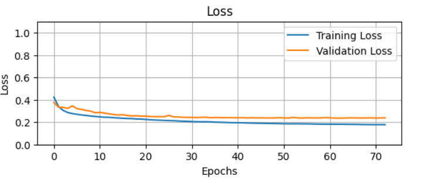

Para o modelo com imagens sintéticas, observa-se que até a 15ª época a perda estava diminuindo tanto no conjunto de treinamento quanto no de validação. No entanto, após essa marca, a perda nos dois conjuntos começou a divergir, com um aumento na perda do conjunto de validação. Nesse modelo, a perda varia entre 0.2 e 0.5, conforme o gráfico apresentado abaixo.

*Perda no modelo com imagem sintética*

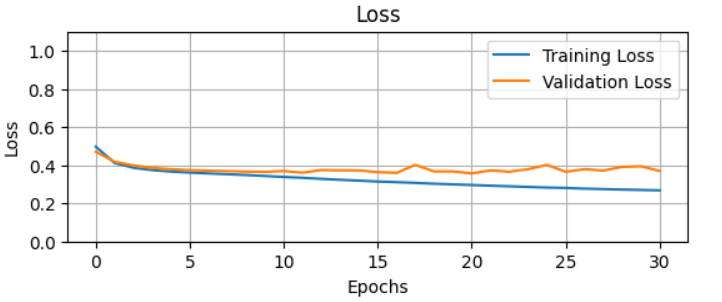

#### 4.1.2 Representação temporal do Recall X Specificity sob Épocas

A avaliação dos modelos envolve o uso de métricas como recall (sensibilidade) e specificity (especificidade). Juntas, essas métricas oferecem uma visão equilibrada do desempenho do modelo, especialmente em contextos onde a distinção entre classes positivas e negativas, como na identificação de talhões, é crucial.

No gráfico abaixo, o modelo avançado apresenta uma variação consistente ao longo das épocas. No entanto, na última época, as duas métricas convergem, com a métrica de specificity atingindo seu pico na 25ª época, com um valor de 0.95, enquanto o recall atinge seu maior valor no final da época, situando-se em 0.85 equalizando as duas métricas.

*Recall X Specificity modelo avançado*

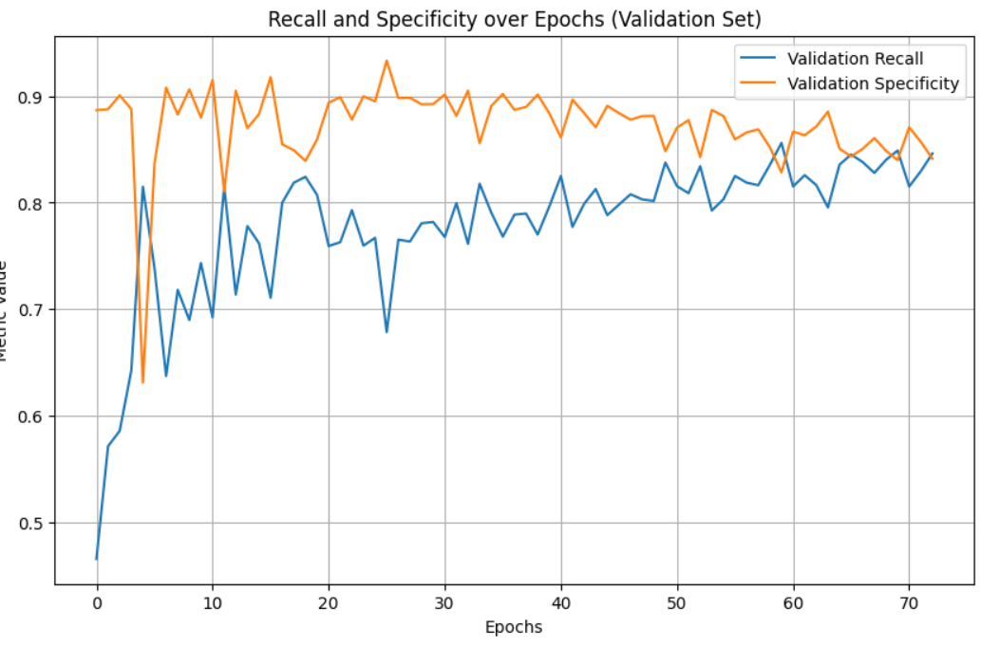

Para o modelo com imagem sintética, observa-se uma alta variação entre as épocas, com um pico de 0.83 em ambas as métricas, embora em épocas diferentes. Há uma leve queda nas últimas épocas.

*Recall X Specificity modelo com imagem sintética*

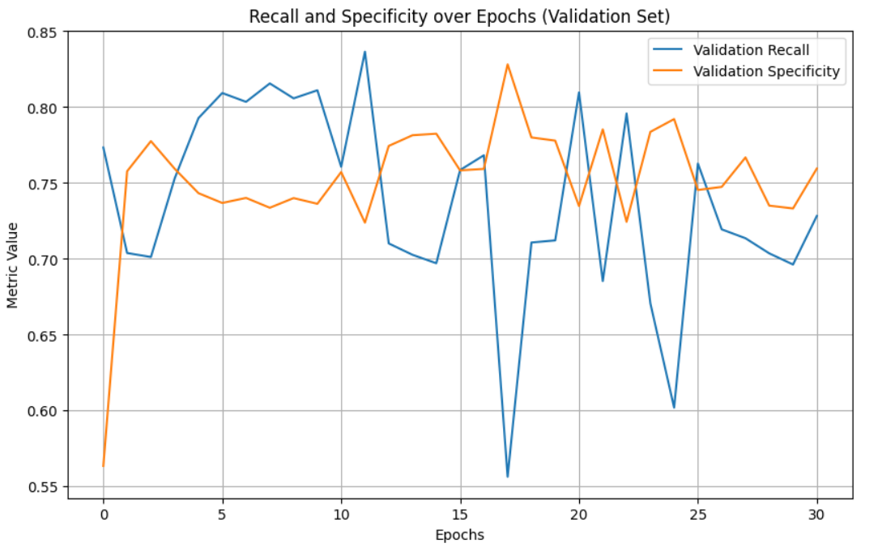

#### 4.1.3 Gráfico de Dispersão em Relação a Performance do Modelo

A abordagem adotada nesta seção do estudo consistirá em demonstrar a dispersão dos dados em planos cartesianos, comparando duas métricas simultaneamente. Essa análise permitirá identificar possíveis inconsistências ou validar hipóteses. Portanto, a representação visual desses gráficos de dispersão será apresentada a seguir:

*Dispersão modelo avançado*

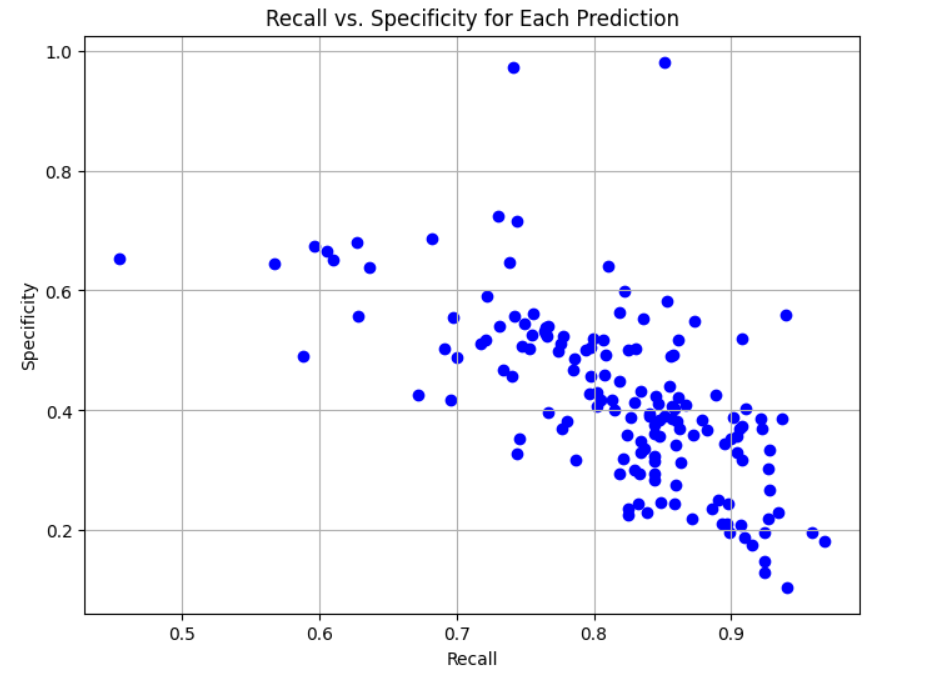

*Dispersão modelo com imagem sintética*

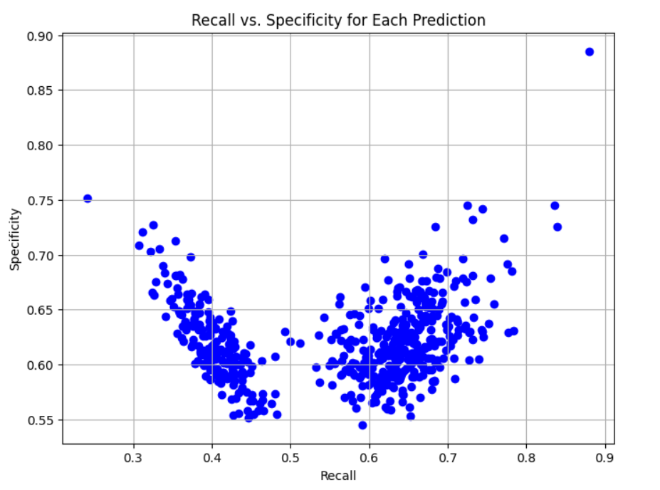

### 4.2 Comparação das predições

Além das métricas, é fundamental realizar uma avaliação qualitativa da segmentação gerada pelo modelo. Isso envolve analisar visualmente as imagens geradas para verificar a precisão e consistência com que o modelo identifica os talhões. Tal avaliação qualitativa complementa as métricas, proporcionando uma visão mais abrangente do desempenho do modelo. Compreender como o modelo segmenta os dados permite identificar possíveis falhas ou áreas de melhoria, garantindo que as métricas refletem verdadeiramente a capacidade do modelo em aplicações práticas.

*Predição modelo avançado 1*

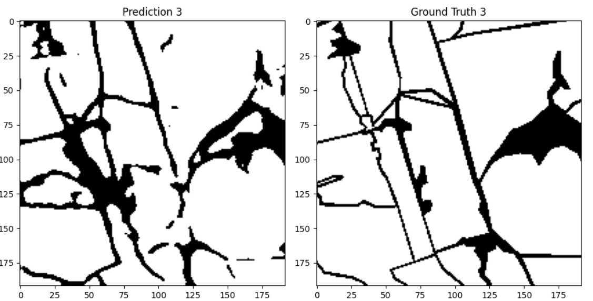

*Predição modelo avançado 2*

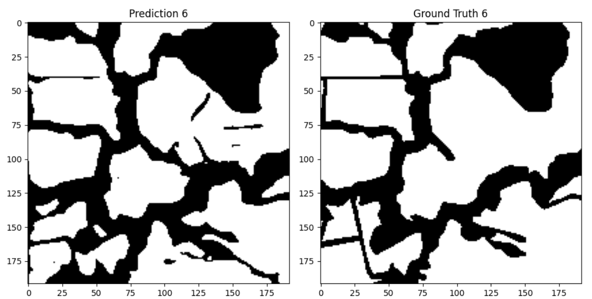

*Predição com imagem sintética 1*

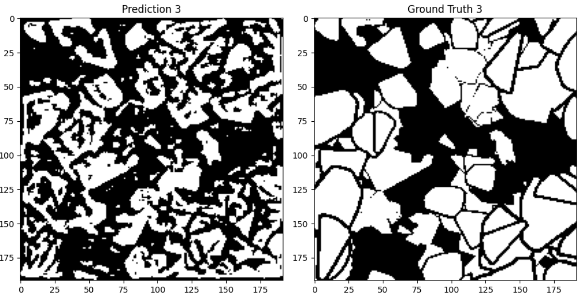

*Predição com imagem sintética 2*

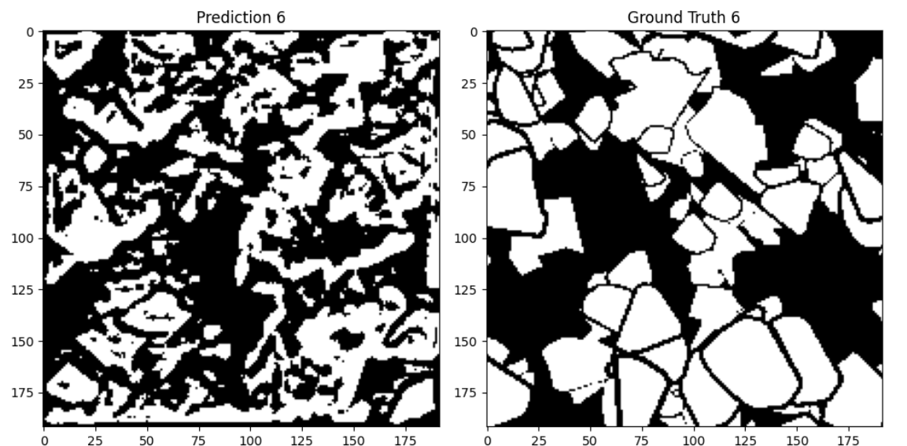

### 4.3 Tabela dos Resultados do GPU e CPU

A análise de desempenho de modelos de visão computacional é essencial para avaliar a eficácia e a eficiência de diferentes arquiteturas. Neste estudo, utilizamos dois ambientes de execução fornecidos pelo Google Colab [[27]](#referencia-27): CPU e T4 GPU. Enquanto a CPU oferece menor velocidade, a T4 GPU é reconhecida por sua capacidade de processamento paralelo, sendo ideal para tarefas que envolvem operações matriciais e redes neurais profundas.

| Modelo   | Configuração | Tempo de Treinamento | Tempo de Inferência | Uso de Memória (MB) |
|----------|--------------|----------------------|----------------------|----------------------|
| Modelo com imagens reais | T4 GPU       | 40 minutos             | 54 segundos           | 39768         |
| Modelo com imagens sintéticas   | T4 GPU       | 17 minutos             | 23 segundos           | 2737         |

É importante ressaltar que os modelos não possui valores para CPU, pois excedeu o limite de memória RAM de 12.7 GB disponibilizada pelo Google Colab [[27]](#referencia-27). Portanto, melhorias no desempenho são necessárias para viabilizar sua execução neste ambiente.

### 4.4 Resultados obtidos em relação aos modelos da literatura

A avaliação dos modelos propostos neste comparativo foi realizada com base nas métricas de desempenho: tempo de treinamento e precisão. A seguir, são apresentados os resultados obtidos em relação aos modelos da literatura:

| Modelos         | Tempo de treino (h)  | Precisão          |
|-----------------|----------------------|-------------------|
| VGG16-U-Net     | 0.27                 | 87%               |
| DenseNet56      | 1.7                  | 75%               |
| SegNet          | 1.5                  | 71%               |
| U-Net           | 1.7                  | 65%               |
| F–CNN           | 1                    | 61%               |

### 4.5 Resultado com pós-processamento

No modelo avançado, foram utilizadas técnicas de pós-processamento, como erosão e dilatação, para alcançar melhores resultados na predição. A erosão é um processo que remove pixels das bordas dos objetos na imagem, reduzindo ruídos e pequenas imperfeições. Esse método é útil para eliminar detalhes indesejados que podem atrapalhar a acurácia do modelo. Já a dilatação adiciona pixels às bordas, aumentando as regiões dos objetos e preenchendo lacunas, o que pode ajudar a conectar componentes disjuntos e melhorar a continuidade das estruturas identificadas pelo modelo.

Essas técnicas de pós-processamento foram aplicadas para refinar as previsões e aprimorar a qualidade das imagens utilizadas para treinamento e teste, potencialmente melhorando a precisão e a robustez do modelo.

*Modelo avançado com pós-processamento*

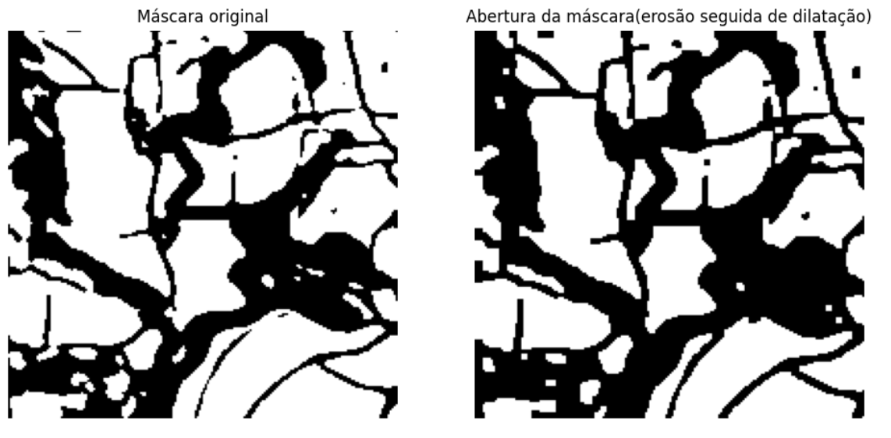

*Modelo com imagem sintética adicionado pós-processamento*

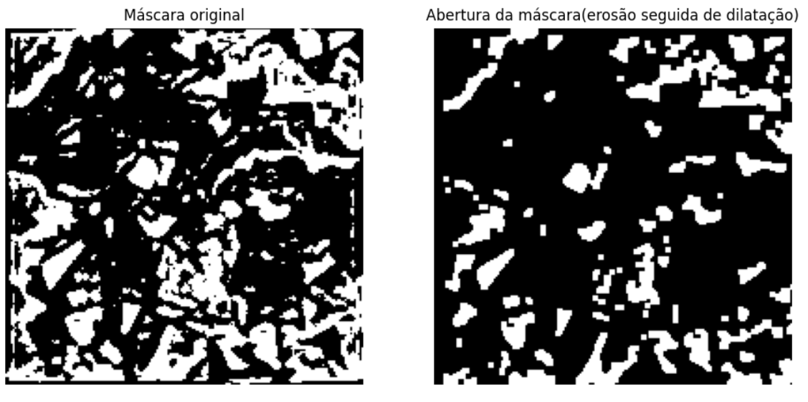

## 5.Análise e Discussão

A [tabela](#tabela-2) apresenta uma comparação de desempenho do modelo U-Net com dados reais disponibilizados pelo parceirode com o mesmo modelo U-net treinado com dados sintéticos desenvolvidos pela equipe de professores de graduação.Vale destacar que o algoritmo que usa imagens reais possui métodos de Data Augmentation mais avançados (discutidos em sesssões anteriores do artigo). Já modelo treinado totalmente por dados sintéticos foram utilizados técnicas de Data Augmentation mais simples (também discutuda em sessões anteriores). Além dos dados de treinamento, está incluso quantidade de imagens de teste, batch size e número de épocas. Por meio da visualização da tabela, é possível identificar que o modelo U-net com dados sintéticos faz um uso maior de imagens, visto que a quantidade de imagens produzidas são maiores comparado ao que foi disponibilizado pelo parceiro, seja para treino ou para teste (divisão 1620 para treino e 540 para teste), enquanto o batch size e o número de épocas é semelhante para ambos os modelos.

O data augmentation com o modelo U-net utilizando dados reais disponibilizados pela empresa foi crucial, pois permitiu a adição de mais dados, aumentando a variabilidade do conjunto de treinamento e a capacidade de generalização do modelo. Em contrapartida, no modelo U-net com dados sintéticos, o data augmentation não foi necessário e, na verdade, contribuiu negativamente para a efetividade do modelo. Observando o uso do data augmentation nos dois modelos, os resultados indicam que o modelo com imagens reais apresenta um maior equilíbrio em relação às métricas utilizadas. Isso ocorre porque o modelo com imagens reais é mais preciso, classificando corretamente os talhões e reduzindo o número de falsos positivos. Assim, esta seção aborda não apenas o desempenho e comparações entre os modelos, mas também suas características complementares, como o impacto do data augmentation, a natureza da segmentação de imagens, e as peculiaridades de avaliação e testes com refinamentos como o pós-processamento.

### 5.1 Comparação de resultados e análise do modelo com GPU e CPU
Com base nos testes efetuados para executar o modelo, foi utilizado T4 GPU e CPU. Contudo, foi possível concluir a execução completa apenas com a T4 GPU. Tal ocorrência se deve ao fato que a CPU possui uma RAM muito limitada para o tamanho e complexidade do modelo que possui camadas e parâmetros que ocupam muito espaço por armazenar pesos, gradientes, quantidade de dados a serem processados e etc. Desse modo, vislumbra-se que a CPU não é tão indicada para modelos de _Deep Learning_, fazendo optar pela GPU que demonstra-se ter uma capacidade maior de lidar com o modelo trabalhado neste estudo.

A partir disso, foi realizada a comparação do modelo com imagens reais e com imagens sintéticas utilizando a T4 GPU, os quais apresentaram resultados discrepantes como é mostrado na [tabela](#43-tabela-dos-resultados-do-gpu-e-cpu). O modelo com imagens reais requer um tempo muito elevado em consideração ao modelo com imagem sintética, cerca de 33 minutos a mais, sendo uma característica que levanta questionamentos se a implementação é vantajosa ou não. Para isso pode-se levantar pontos de melhoria, como diminuir ou optar por outros métodos no data augmentation que evitem piorar o [modelo](#4-resultados). Ademais, também mostrou-se ter um tempo de inferência maior, tendo sentido ao analisar que o modelo com imagem sintética possui mais operações, que devido a suas complexidades, demanda mais tempo.

### 5.3 Interpretação e abordagem com e sem image segmentation
Dado que os modelos utilizados se baseiam na U-Net, eles são capazes de segmentar eficazmente as áreas de interesse nas imagens, pois sua arquitetura é projetada especificamente para essa finalidade. A aplicação de técnicas de data augmentation desempenha um papel vital em aprimorar a precisão das detecções do modelo trabalhado. Ao expandir o conjunto de dados de treinamento através de transformações como rotações, mudanças de escala e ajustes de iluminação, o data augmentation permite que o modelo aprenda a reconhecer talhões em uma variedade mais ampla de condições visuais.

No caso do modelo U-Net utilizando dados reais disponibilizados pela empresa, o data augmentation foi crucial, pois permitiu a adição de mais dados, aumentando a variabilidade do conjunto de treinamento e a capacidade de generalização do modelo. Em contraste, no modelo U-Net com dados sintéticos, o data augmentation não foi necessário e, na verdade, contribuiu negativamente para a efetividade do modelo.

A complexidade adicional nos métodos de data augmentation, que ajuda na segmentação do modelo avançado, possivelmente contribui para o overfitting, onde o modelo se torna excessivamente adaptado ao conjunto de dados de treinamento e, consequentemente, perde sua capacidade de generalizar novos dados. Esta situação mostrou a importância de ter cautela na escolha das técnicas de data augmentation, assegurando que a expansão da diversidade do conjunto de dados não comprometa a utilidade prática do modelo. O modelo com dados sintéticos é um grande exemplo disso, onde os métodos adicionais pioraram o desempenho do modelo, conforme ilustrado no gráfico. Por isso, optou-se por usar um data augmentation mais simples, que não prejudicasse a eficácia do modelo.

Sendo assim, ao utilizar as métricas de avaliação como ponto focal na interpretação dos [resultados](#411-representação-temporal-da-métrica-loss-perda-sob-épocas), salienta-se a preferência que, mesmo não tendo uma "_loss_" baixa como é o caso do modelo utilizando dados sintéticos, tenha um valor de perda entre intervalos de 0,1 a 0,4 ao invés de um valor constante. Obtendo métricas mais equilibradas como visto anteriormente, também é abordado a especificidade do modelo para avaliar a proporção de verdadeiros negativos, que nesse cenário se refere as áreas corretamente identificadas como não sendo talhões, evitando falsos positivos. Nesse sentido, o uso de menos técnicas expõe uma disparidade em que o simplificado mostra-se com métricas mais consistentes, com menos propensão de _overfitting_, surgindo possibilidades positivas que podem ser consideradas ao entender melhor as condições de falha ou calibrar o modelo avançado com objetivo de chegar num "specificity" mais alto e validação mais extensiva para que possa superar o modelo com imagens reais.

Ainda no quesito central de segmentação, em busca de melhorar especialmente a precisão do modelo, o pós-processamento foi um tipo de refinamento encontrado e que tem potencial de desempenhar o papel de melhorar os resultados obtidos após a predição, principalmente por corrigir Over-segmentation e Under-segmentation. O primeiro divide excessivamente a região que deveria ser contínua, o segundo ou under-segmentation, não consegue dividir regiões distintas. O pós-processamento ajusta esses erros que torna o modelo vulnerável e assegura que a segmentação corresponda mais precisamente à realidade física dos talhões. Por isso, a partir dos [resultados](#44-resultado-com-pós-processamento), é visto redução de alguns ruídos e brechas das imagens segmentadas, destaca-se em alguns casos a suavilização de bordas, o que culmina em uma representação mais precisa das fronteiras dos talhões e ajustes mais finos.

### 5.4 Comparação dos resultados obtidos em relação a modelos presentes na literatura
Conforme explorado na seção [5.3](#53-interpretação-e-abordagem-com-e-sem-image-segmentation), a identificação e segmentação de áreas de cultivo através da visão computacional envolvem desafios significativos devido a uma série de complexidades que um modelo sem image segmentation com certeza não conseguiria suprir. Esta tarefa foi abordada por RUOYU [[33]](#referencia-33), que utilizaram imagens do satélite WorldView-3 da região de Patuakhali, localizada no sul de Bangladesh, para desenvolver modelos com o intuito de demarcar os limites de áreas agrícolas do local. Os modelos F–CNN, U-Net, SegNet e DenseNet, os quais foram abordados no paper, concentram-se principalmente na identificação espacial e na delimitação dos limites dos talhões.

A arquitetura U-Net, conhecida por sua eficácia na segmentação de imagens, foi adaptada neste trabalho para incorporar características de uma rede U-net pré-treinada, levando em consideração a literatura já citada anteriormente, modelos como F-CNN, U-Net, SegNet e DenseNet foram destacados por sua capacidade de mapear espacialmente grandes áreas agrícolas. No entanto, estes modelos serviram como comparativo, estabelecendo um plano de fundo para a discussão sobre as capacidades do modelo U-Net deste estudo.

Ao observarmos apenas as métricas de tempo de treino e precisão atingida na [tabela](#44-resultados-obtidos-em-relação-aos-modelos-da-literatura) podemos pensar que o modelo implementado pelo grupo desempenha relativamente melhor que os modelos apresentados nos papers. Contudo, devemos analisar as relações de Falsos Positivos x Verdadeiros Positivos e Falsos Negativos x Verdadeiros Negativos, uma vez que a base de dados pode apresentar uma predominância de uma classe em relação à outra.

Analisando tais resultados presentes em outros trabalhos, percebe-se que apesar do desempenho destacado do modelo U-Net em precisão, há espaço para melhorias na segmentação de áreas agrícolas, especialmente em bordas finas e irregulares, como evidenciado pela análise de falsos positivos na seção [5.3](#53-interpretação-e-abordagem-com-e-sem-image-segmentation). Portanto, serve como um embasamento que auxilia na compreensão de nuances de cada modelo em termos de reconhecimento de talhões.

## 6. Conclusão

O presente estudo demonstrou o potencial da arquitetura U-Net com encoder VGG16 para a segmentação precisa de talhões agrícolas usando, inicialmente, um conjunto de dados de imagens de satélite e, posteriormente, imagens sintéticas geradas por um modelo matemático, o qual não atingiu a precisão desejada. A aplicação de técnicas de _data augmentation_, transferência de aprendizado e pós-processamento permitiu aprimorar a detecção de talhões e melhorar a precisão na identificação de bordas, onde o modelo com o conjunto de dados de satélite obteve um resultado satisfatório nas métricas de _recall_, _precision_ e _specificity_, enquanto o modelo com imagens sintéticas apresentou uma piora nas mesmas métricas, não atingindo um resultado geral satisfatório.

Entretanto, o modelo desenvolvido teve sua direção para resolver o problema específico de talhões agrícolas na Região Sul do Brasil, com a utilização de imagens de satélite. Com isso, utilizar imagens sintéticas no modelo fez com que ele apresentasse uma piora em suas métricas. A utilização de conjuntos de dados mistos ou novas imagens reais podem variar as métricas do modelo e o refinamento das técnicas de _data augmentation_ e pós-processamento de dados podem ajudar na identificação das linhas mais finas e irregulares dos talhões são sugestões que podem tornar o modelo ainda mais equilibrado e mais preciso quanto a identificação e segmentação de talhões em trabalhos futuros.

## Referências 

1. WEISS, M. et al. Remote sensing for agricultural applications: a meta-review, 2019. Disponível em: https://www.sciencedirect.com/science/article/abs/pii/S0034425719304213. Acesso em: 17/05/2024.
  
2. SILVA, P. et al. Metodologias de visão computacional para contagem de plantas por meio de imagens de satélite, 2019. Disponível em: https://sol.sbc.org.br/index.php/erigo/article/view/9092/8994. Acesso em 25/04/2024.

3. NEVAVOURI, P. et al. Crop yield prediction with deep convolutional neural networks, 2019. Disponível em: https://www.sciencedirect.com/science/article/abs/pii/S0168169919306842. Acesso em: 17/05/2024.

4. Zhang, C. et al. An object-based convolutional neural network (OCNN) for urban land use classification, 2018. Disponível em: https://www.sciencedirect.com/science/article/abs/pii/S0034425718303122. Acesso em: 17/05/2024.

5. A. Sharma, A. Jain, P. Gupta and V. Chowdary, "Machine Learning Applications for Precision Agriculture: A Comprehensive Review," in IEEE Access, vol. 9, pp. 4843-4873, 2021, doi: 10.1109/ACCESS.2020.3048415.

6. Kember, R. et al. Algorithms for semantic segmentation of multispectral remote sensing imagery using deep learning, 2018. Disponível em: https://www.sciencedirect.com/science/article/abs/pii/S0924271618301229. Acesso em: 17/05/2024.

7. FRACAROLLI, J. et al. Computer vision applied to food and agricultural products, 2020. Disponível em: http://periodicos.ufc.br/revistacienciaagronomica/article/view/84918/229070. Acesso em: 24/04/2024.

8. LORENSINI, C. et al. Modelos Preditivos para Classificação de Aptidão Agrícola de Municípios, 2018. Disponível em: https://ainfo.cnptia.embrapa.br/digital/bitstream/item/188293/1/Mostra-2018-38-43.pdf. Acesso em: 25/04/2024.

9.  A. Sharma, A. Jain, P. Gupta and V. Chowdary, "Machine Learning Applications for Precision Agriculture: A Comprehensive Review," in IEEE Access, vol. 9, pp. 4843-4873, 2021, doi: 10.1109/ACCESS.2020.3048415. Acesso em 23/05/2024.

10. Wang Y-H, Su W-H. Convolutional Neural Networks in Computer Vision for Grain Crop Phenotyping: A Review. Agronomy. 2022; 12(11):2659. https://doi.org/10.3390/agronomy12112659. Acesso em: 24/05/2024.

11. Fukuda, M.; Okuno, T.; Yuki, S. Central Object Segmentation by Deep Learning to Continuously Monitor Fruit Growth through RGB Images. Sensors 2021, 21, 6999. Disponível em: https://doi.org/10.3390/s21216999. Acesso em: 20/05/2024

12. Hashemi-Beni L., Gebrehiwot A., Karimoddini A., Shahbazi A. and Dorbu F. (2022) Deep Convolutional Neural Networks for Weeds and Crops Discrimination From UAS Imagery. Front. Remote Sens. 3:755939. doi: 10.3389/frsen.2022.755939. Disponível em: https://www.frontiersin.org/articles/10.3389/frsen.2022.755939/full. Acesso em: 24/05/2024

13. Zrigui, M., Mallat, S. and Joudah, A. (2021) Analyzing satellite images by apply deep learning instance segmentation of agricultural fields. doi: http://dx.doi.org/10.21533/pen.v9i4.2569. Disponível em: https://www.researchgate.net/publication/357737257_Analyzing_satellite_images_by_apply_deep_learning_instance_segmentation_of_agricultural_fields. Acesso em: 26/05/2024

14. GOROKHOVA, I. N. et al. Agricultural lands identification on the satellite imagery, 2021. Disponível em: https://cyberleninka.ru/article/n/agricultural-lands-identification-on-the-satellite-imagery/viewer. Acesso em 25/04/2024.

15. Geison Leal Feitosa, Análise de imagens de satélite para classificação de áreas cultivadas, 2021. Disponível em: https://repositorio.pucgoias.edu.br/jspui/bitstream/123456789/3534/1/TCC-Geison-2021.pdf. Acesso em 28/04/2024.

16. Douglas Loureiro Pimentel, Utilização de visão computacional para detecção do uso correto de máscara, 2022. Disponível em: https://repositorio.ifes.edu.br/bitstream/handle/123456789/3861/TCC_Utiliza%C3%A7%C3%A3o_de_Vis%C3%A3o_Computacional_para_Detec%C3%A7%C3%A3o_do_Uso_Correto_de_Mascara.pdf?sequence=1&isAllowed=y. Acesso em 28/04/2024.

17. FERNANDES, Leandro Augusto Frata. Visão Computacional. E-mail: laffernandes@ic.uff.br. 2012.

18. VANDERPLAS, Jake. Python Data Science Handbook: Essential Tools for Working with Data. 1st ed. Sebastopol: O'Reilly Media, 2016. Disponível em: https://www.amazon.com/Python-Data-Science-Handbook-Essential/dp/1491912057. Acesso em: 23 maio 2024.

19. CHOLLET, François. Deep Learning with Python. 1st ed. Shelter Island: Manning Publications, 2018. Disponível em: https://www.amazon.com/Deep-Learning-Python-Francois-Chollet/dp/1617294438. Acesso em: 23 maio 2024.

20. YAKUBOV, Pavel. segmentation_models - Python library with Neural Networks for Image Segmentation, 2018. Read the Docs. Disponível em: https://segmentation-models.readthedocs.io/en/latest/. Acesso em: 23 maio 2024.

21. PILLOW (PIL Fork) Documentation. Pillow Documentation. Disponível em: https://pillow.readthedocs.io/en/stable/. Acesso em: 23 maio 2024.

22. PYTHON SOFTWARE FOUNDATION. random — Generate pseudo-random numbers. Python Documentation. Disponível em: https://docs.python.org/3/library/random.html. Acesso em: 23 maio 2024.

23. PYTHON SOFTWARE FOUNDATION. time — Time access and conversions. Python Documentation. Disponível em: https://docs.python.org/3/library/time.html. Acesso em: 23 maio 2024.

24. GUARDIOLA, Giampaolo Rodola. psutil - Cross-platform lib for process and system monitoring in Python. Psutil Documentation. Disponível em: https://psutil.readthedocs.io/en/latest/. Acesso em: 23 maio 2024.

25. STÉFAN VAN DER WALT et al. scikit-image: Image processing in Python. scikit-image Documentation, 2014. Disponível em: https://scikit-image.org/docs/stable/. Acesso em: 23 maio 2024.

26. JONES, Eric; OLIPHANT, Travis; PETERSON, Pearu et al. SciPy: Open source scientific tools for Python. SciPy Documentation, 2001. Disponível em: https://docs.scipy.org/doc/scipy/. Acesso em: 23 maio 2024.

27. GOOGLE LLC. Google Colaboratory Documentation. Disponível em: https://colab.research.google.com/notebooks/welcome.ipynb. Acesso em: 23 maio 2024.

28. ALSABHAN, et al. Detecting Buildings and Nonbuildings from Satellite Images Using U-Net, 2022. Disponível em: https://www.hindawi.com/journals/cin/2022/4831223/. Acesso em: 22/05/2024.

29. GÉRON Aurélien. Mãos à Obra: Aprendizado de Máquina com Sckit-Learn, Keras & TensorFlow. 2. ed. Rio de Janeiro: Alta Books, 2021.

30. SUDRE C, et al. Generalised Dice overlap as a deep learning loss function for highly unbalanced segmentations, 2017. Disponível em: https://arxiv.org/abs/1707.03237v3. Acesso em: 22/05/2024.

31. VUJOVIC Z. Classification Model Evaluation Metrics, 2021. Disponível em: https://www.researchgate.net/publication/352902406_Classification_Model_Evaluation_Metrics. Acesso em: 22/05/2024.

32. ZHAO X, et al. A review of convolutional neural networks in computer vision, 2024. Disponível em: https://link.springer.com/article/10.1007/s10462-024-10721-6#Sec2. Acesso em 17/05/2024.

33. RUOYU, Y. et al. Detecting functional field units from satellite images in smallholder farming systems using a deep learning based computer vision approach: A case study from Bangladesh, 2020. Disponível em: https://www.sciencedirect.com/science/article/pii/S2352938519301831#sec1. Acesso em 24/05/2024.

34. FURKAT, S. et al. Improved Agricultural Field Segmentation in Satellite Imagery Using TL-ResUNet Architecture, 2022. Disponível em: https://www.mdpi.com/1424-8220/22/24/9784. Acesso em 25/05/2024.

35. Goodfellow, I., Bengio, Y., & Courville, A. (2016). Deep Learning. MIT Press, Capítulo 8. Disponível em: https://www.deeplearningbook.org/. Acesso em 09/06/2024.

36. Zhangxi Ye, Kaile Yang, Yuwei Lin, Shijie Guo, Yiming Sun, Xunlong Chen, Riwen Lai, Houxi Zhang. A comparison between Pixel-based deep learning and Object-based image analysis (OBIA) for individual detection of cabbage plants based on UAV Visible-light images, Computers and Electronics in Agriculture, Volume 209, 2023, 107822, ISSN 0168-1699. Disponível em: https://doi.org/10.1016/j.compag.2023.107822. Acesso em 10/06/2024.

37. Wesley James Weatherbee, Saint Mary's University, Jonathan Fowler (Author), 
Saint Mary's University, Danika van Proosdij (Author). (2023). Saint Mary's University. Automated rapid artefact surface area measurement from imagery with computer vision. Disponível em: https://doi.org/10.1016/j.compag.2023.107822. Acesso em 18/06/2024.

